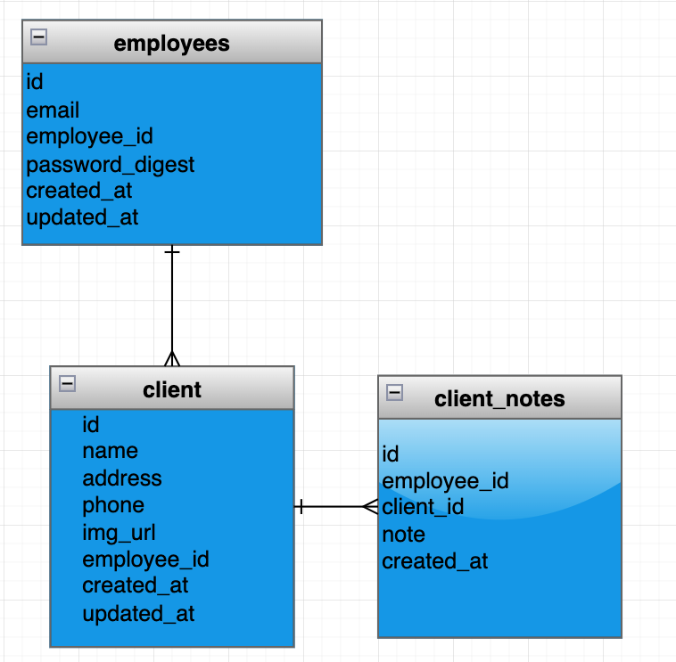

# Little_Butler

- [Little_Butler](#little_butler)
	- [Overview](#overview)
	- [MVP](#mvp)
		- [Goals](#goals)
		- [Libraries and Dependencies](#libraries-and-dependencies)
		- [Client (Front End)](#client-front-end)
			- [Wireframes](#wireframes)
			- [Component Tree](#component-tree)
			- [Component Architecture](#component-architecture)
			- [Time Estimates](#time-estimates)
		- [Server (Back End)](#server-back-end)
			- [ERD Model](#erd-model)
	- [Post-MVP](#post-mvp)
	- [Code Showcase](#code-showcase)
	- [Code Issues & Resolutions](#code-issues--resolutions)

<br>

## Overview

_**Little_Buttler** Is an assitent for Personal Assistants LLC.\* . Track the littel things about the clients like their likes and dislikes, prefrences._

<br>

## MVP

\_The **Little_Butler** MVP
allow the employees to log in
Full crud client

<br>

### Goals

- _Create a functioning fullstack app._

<br>

### Libraries and Dependencies

|     Library      | Description                                |
| :--------------: | :----------------------------------------- |
|      React       | _Front end._                               |
|   React Router   | _Lorem ipsum dolor sit amet, consectetur._ |
| React SemanticUI | _Lorem ipsum dolor sit amet, consectetur._ |
|     Express      | _Lorem ipsum dolor sit amet, consectetur._ |
|  Express Router  | _Lorem ipsum dolor sit amet, consectetur._ |
|      Rails       |                                            |
|      Axios       |                                            |
|      Bcrypt      | _Backend encryption_                       |
|       JWT        | _for token based authentication_           |

<br>

### Client (Front End)

#### Wireframes

- Mobile Landing

https://www.figma.com/file/Dx9qXzs4p3U4qjLfG3iIFX/Untitled?node-id=3%3A25

#### Component Tree

[Component Tree Sample](https://whimsical.com/lilbutler-PMrdqv6Hqg6q4yz9aKSPh2)

#### Component Architecture

```structure

src
|__ components/
	  |__ Footer.jsx
      |__ Header.jsx
|__container/
	  |__ MainContainer.jsx
|__ services/
	  |__ apiConfig.js
	  |__ auth.js
	  |__ client.js
	  |__ note.js
|__ screens/
	  |__ ClientCreate.jsx
	  |__ ClientDetails.jsx
	  |__ ClientEdit.jsx
	  |__ Clients.jsx
	  |__ login.jsx
	  |__ Notes.jsx
|__App.js
|__App.css
|__Layout.jsx
```

#### Time Estimates

> Use this section to estimate the time necessary to build out each of the components you've described above.

| Task                      | Priority | Estimated Time | Time Invested | Actual Time |
| ------------------------- | :------: | :------------: | :-----------: | :---------: |
| Backend                   |    H     |     3 hrs      |     2 hrs     |    8 hrs    |
| Frontend Crud Connections |    H     |     3 hrs      |     1 hrs     |    8 hrs    |
| auth                      |    L     |      2hr       |     8 hr      |     8hr     |
| TOTAL                     |          |     24hrs      |    21 hrs     |   24 hrs    |

<br>

### Server (Back End)

#### ERD Model

[ERD Sample](https://drive.google.com/file/d/1kLyQTZqfcA4jjKWQexfEkG2UspyclK8Q/view)

<br>

---

## Post-MVP

-be able to add notes to client pages
-extensive styling

---

## Code Showcase

```
export default function ClientEdit({ clients, handleClientUpdate, currentEmployee}) {
```

## Code Issues & Resolutions

Misplaces S and missing ones
misnamed varibles
